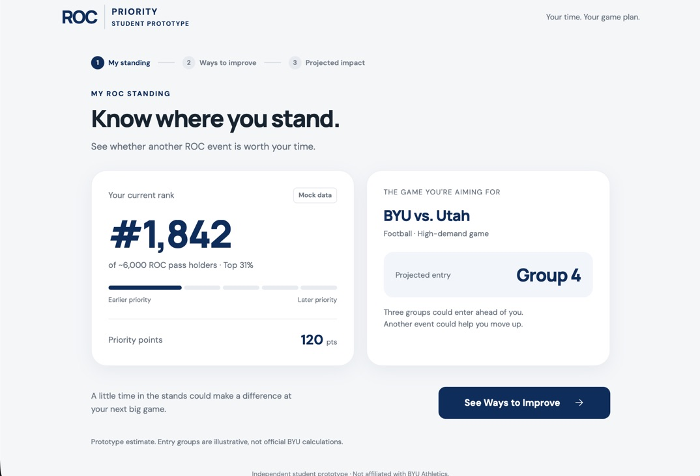
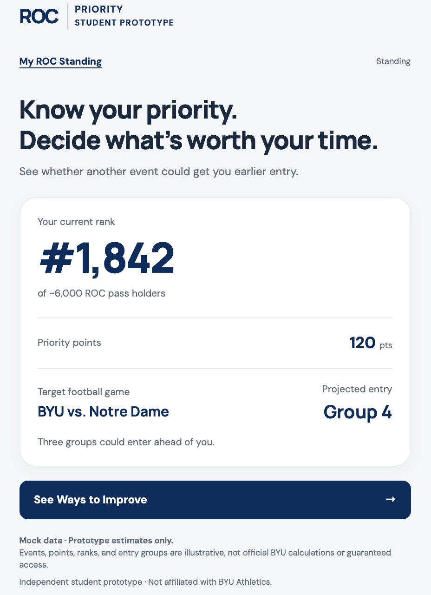

# ROC Priority — Student Prototype

[Live prototype](https://roc-priority.vercel.app) · [Original AI commit](https://github.com/brandonfromm-353/ROC-priority/commit/e4f89db53994f940c398870ca43bce5b15466df6) · [Revision photos](#before-and-after)

## 1. Core hypothesis

- **Need:** Between school and work, ROC pass holders guess whether another Olympic event will improve entry priority, risking scarce free time or skipping an event that could help.
- **Persona:** A ROC pass holder balancing classes, work, dating, and time with family and friends who fits athletic events into limited free evenings in order to get into the Notre Dame game.
- **Capability:** Compare an event’s time commitment with its projected improvement in ROC priority to judge whether attending is worth the time.
- **Fundamental value — Control:** Decide where to spend limited time to get the ROC access they want.

## 2. Three screens

| Screen | Single job; why it earned a slot | Design question |
| --- | --- | --- |
| **My ROC Standing** | Establish current priority and its meaning for BYU vs. Notre Dame; decisions need a starting point. | Do rank and entry group explain where I stand and why it matters? |
| **Ways to Improve** | Compare event schedules, time, and estimated points; provide actionable choices. | Can students identify a worthwhile event that fits their time? |
| **Projected Impact** | Show the selected event’s before/after outcome; provide the decision’s payoff. | Does the projection help students judge whether attendance is worth it? |

## 3. Design question plan

| Question | Predicted answer | Prototype basis |
| --- | --- | --- |
| **Need:** “Last time you considered an event to get priority points, how did you decide whether to go?” | “I had homework and wasn’t sure it would help, so I skipped it.” | Time beside estimated points. |
| **Value:** “If you knew whether another event would get you earlier entry, what would that give you?” | “Control. I could decide if it’s worth my time.” | Headline and entry-group projection. |
| **Persona:** “With the Notre Dame game coming up, how often are you thinking about earning more ROC points, and what else are you usually juggling when you consider going to an event?” | “Often because I really want a ticket, but I have to fit events around classes, work, and plans with other people.” | BYU vs. Notre Dame target game. |
| **Capability:** “I’ll show this for five seconds, then hide it. What does it help you do?” | “Check my rank and see whether another event could get me in earlier.” | Large rank, group, and improvement button. |

## 4. First read and design justification

- **First glance:** The large rank number stands out right away. The headline, “Know your priority. Decide what’s worth your time,” explains the value. The affordance sentence, “See whether another event could get you earlier entry,” tells students what the app helps them do. You can see the rank, entry group, and see ways to improve buttons all fit without scrolling.
- **Hierarchy:** I kept the information students need most: their rank, points, target game, and expected entry group. I removed the extra slogan, percentage, rank bar, and step numbers because they added clutter. The mock-data note makes it clear these are estimates.
- **Grouping:** On Screen 1, the rank and target game share one card so students can connect them (**common region**). On Screen 2, each date sits beside its event, and the time commitment sits beside the points (**proximity**). On Screen 3, the before-and-after cards use matching layouts so they are easy to compare (**similarity**). The same fonts, cards, and navy buttons help all three screens feel like one app.
- **Staying focused:** Screen 2 helps students pick an event, and Screen 3 shows whether it could improve their standing. Both support the main question: “Is this game worth my time?” Every screen has a clear link back to My ROC Standing, and I checked that the links work on the live site.

### Before and after

| Initial AI output | Revised Version |
| --- | --- |
|  |  |

The original AI version put the current rank and target game in two separate, similarly sized cards. This gave them similar visual weight and made them feel like separate pieces of information. The **visual hierarchy** did not clearly show how the student’s rank connected to their entry group for that game.

I combined them into one card, with the current rank first and the target game and projected entry group underneath. This uses **common region** to show that the information belongs together. I also removed the rank bar and extra slogan so there was less competing for attention. The revised screen makes it easier to answer, “Where do I stand, and what does that mean for the game I want to attend?”
